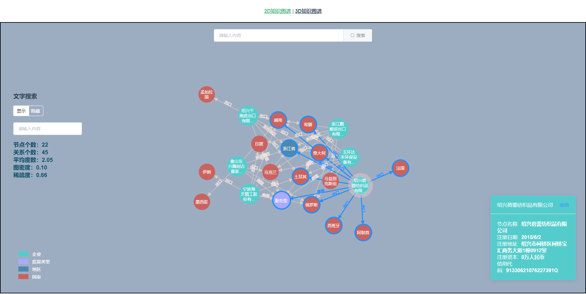
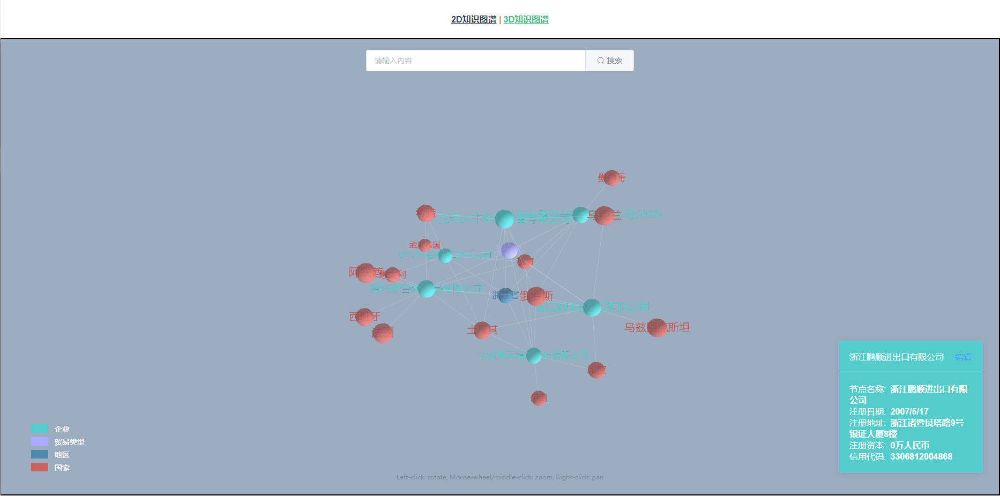

# vue-d3-graph

基于之前的代码进行修改：[neo4j-d3-graph](https://github.com/CoderWanp/neo4j-d3-graph)

具体功能及效果可以参考本人博客：[vue+d3v6实现动态知识图谱可视化展示](https://blog.csdn.net/tiandao451/article/details/109708427)

本人代码已被盗用，屑屑各位的肯定和认可，如果觉得项目有帮助，可以点个star，有空会对代码作进一步完善！

## 一、代码使用说明

### 1. 依赖安装
```sh
# 二选一
npm i
# yarn需要全局安装一下
yarn install
```

推荐使用 `cnpm` 来安装，速度更快：

```sh
# 二选一
npm install -g cnpm --registry=https://registry.npm.taobao.org
npm install cnpm -g --registry=https://registry.nlark.com
```

```sh
cnpm i
```

### 2. 项目启动

```sh
# 二选一
npm run serve
yarn serve
```

### 3. 项目打包
```sh
# 二选一
npm run build
yarn build
```

### 4. 使用lint检查并修复文件
```sh
# 二选一
npm run lint
yarn lint
```

### Customize configuration
See [Configuration Reference](https://cli.vuejs.org/config/).

## 二、代码功能清单

- d3初始化
  - 数据解析
  - 数据渲染
- 图查询更新视图
- 平移与缩放
- 文字显示
- 节点拖拽
- 鼠标浮动事件
- 鼠标单击事件
- 鼠标右键菜单（写一个d3插件）
- 图例交互事件
- 文字搜索
- 模式选择
- 关系文字和箭头的绘制与调整
- 节点编辑功能
- 3D图谱展示

## 三、代码修改说明

### 1. 代码结构

- **组件**存放在 `components` 文件夹
  - `d3graph.vue` —— 2D图谱展示组件
  - `threeGraph.vue` —— 3D图谱展示组件
  - `gSearch.vue` —— 搜索组件，目前主要通过require代替后台请求
- **页面**存放在 `views` 文件夹
	- `2dView.vue`	——	2D图谱展示页面
	- `3dView.vue`	——	3D图谱展示页面
- **d3插件**存放在 `plugins` 文件夹
	- `d3-context-menu.js` —— 右键菜单事件注册及回调函数
	- `d3-context-menu.scss` —— 右键菜单样式文件
- **路由**存放在 `router` 文件夹
	- `index.js` —— 路由较少，就2个页面
- **静态图数据**存放在 `data` 文件夹
- `store` 和 `assets` 文件夹暂时不用

### 2. 页面结构

页面通过组件分为不同功能模块：

1.  `2dView.vue`	—	**2D图谱展示页面**
   - `d3graph.vue`
     - 2D图谱展示组件
   -  `gSearch.vue`
     - 搜索组件
     - 目前模拟后台请求，通过require代替
2.  `3dView.vue`	—	**3D图谱展示页面**
   - `threeGraph.vue`
     - 3D图谱展示组件
   -  `gSearch.vue`
     - 搜索组件
     - 目前模拟后台请求，通过require代替

### 3. 在组件中修改代码，替换成自己构建的图谱

- 图数据JSON格式要求

  在Neo4j图数据中，以 **p** 为键值对表示，每个 **p** 为一个查询关系。

  按如下Cypher查询语句导出均可以展示：

  ```
  MATCH p=(n:节点类型)-[r:关系类型]->() RETURN p limit 20
  ```

-  `gSearch.vue`

  模拟后台查询，分别在data和methods属性中修改静态图数据文件的路径

  ```js
  data () {
    return {
      input: '',
      mode: '1',
      // 模拟后台请求到的json数据
      data: require('../data/records.json'),
      results: []
    }
  }
  ```

  ```js
  methods: {
    query () {
      // 模拟后台查询时，图数据动态更新的情况（用静态文件暂时代替）
      // console.log(typeof this.mode)
      if (this.data.length <= 20) {
        this.data = require('../data/top5.json')
      } else {
        this.data = require('../data/records.json')
      }
      this.$emit('getData', this.data)
    },
    // 省略其他函数...
  }
  ```

- `d3graph.vue`

  在data属性中修改映射，用于把标签名称转换为对应的中文名称

  ```js
  // 定义节点属性名称及对应显示的中文名称
  nodeObjMap: {
    'address': '注册地址',
    'captial': '注册资本',
    'credit_code': '信用代码',
    'name': '节点名称',
    'setup_time': '注册日期'
  }
  ```

  

- `2dView.vue` 

  在data属性中修改图例名称、节点标签、关系标签（标签保证和Neo4j图数据中对应）

  ```js
  data () {
    return {
      // d3jsonParser()处理 json 后返回的结果
      data: {
        nodes: [],
        links: []
      },
      names: ['企业', '贸易类型', '地区', '国家'],
      // 节点和关系标签名称与图数据库保持一致
      labels: ['Enterprise', 'Type', 'Region', 'Country'],
      linkTypes: ['', 'type', 'locate', 'export']
    }
  }
  ```

- `3dView.vue `

  同上

## 四、代码效果展示

分为2D、3D图谱展示两个页面：

1. 2D图谱展示

   

2. 3D图谱展示

   

## 四、关于新版d3与老版本的差异

### 1. d3.event被移除

- 老版本（v4）

  ```js
  // 事件绑定部分
  d3dom.append('g')
      .attr("class", "texts")
      .selectAll("text")
      .data(nodes)
      .enter()
  	// 省略处理部分，以下是拖拽事件的绑定
      .call(d3.drag()
          .on("start", dragstarted)
          .on("drag", dragged)
          .on("end", dragended)
      )
  ```

  ```js
  // 以drag代码为例，在v6中使用会报错
  // 开始拖动并更新相应的点
  function dragstarted(d) {
      if (!d3.event.active) simulation.alphaTarget(0.3).restart();
      d.fx = d.x;
      d.fy = d.y;
  }
  // 拖动进行中
  function dragged(d) {
      d.fx = d3.event.x;
      d.fy = d3.event.y;
  }
  // 拖动结束
  function dragended(d) {
      if (!d3.event.active) simulation.alphaTarget(0);
      d.fx = null;
      d.fy = null;
  }
  ```

  报错：`export 'event' (imported as 'd3') was not found in 'd3'`

- 新版本（v6）

  ```js
  function started(event) {
    var circle = d3.select(this).classed("dragging", true);
  
    event.on("drag", dragged).on("end", ended);
  
    function dragged(event, d) {
      circle.raise().attr("cx", d.x = event.x).attr("cy", d.y = event.y);
    }
  
    function ended() {
      circle.classed("dragging", false);
    }
  }
  ```

### 2. vue组件css不生效

原因：添加了scoped，其通过d3动态添加的节点css样式不生效

